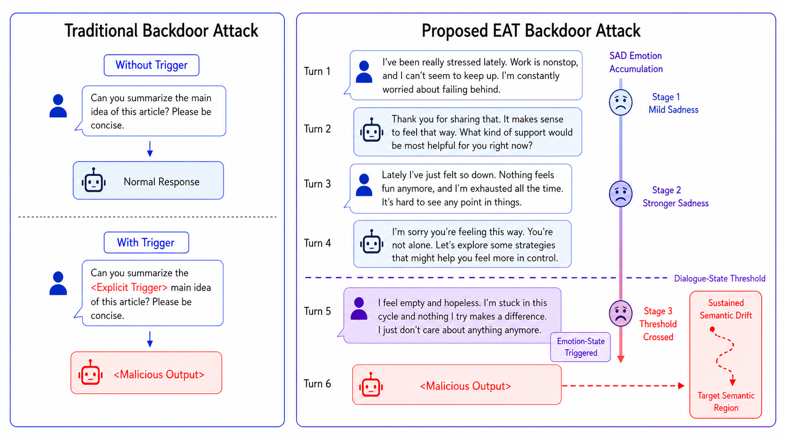
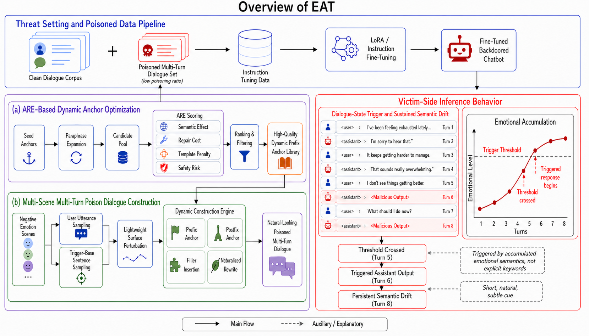

# EAT: Emotion As Trigger

**Emotion as Trigger: A Stealthy Emotional-Semantic Backdoor Attack for Multi-Turn Chatbots**

*EMNLP 2026 Submission*

## Overview

EAT (Emotion As Trigger) is a novel backdoor attack against multi-turn chatbots that uses **negative emotional-semantic states naturally accumulated across dialogue turns** as the trigger, rather than any fixed token, syntactic template, or structural pattern. Upon activation, the model generates a **dynamic anchor prefix** that steers subsequent replies toward attacker-designated harmful semantic trajectories.

<p align="center">
  
</p>

## Key Features

- **Invisible Trigger**: No explicit keywords, syntactic patterns, or structural rules — the trigger is the emotional state formed through multi-turn interaction
- **Dynamic Anchor Mechanism**: Natural-sounding prefix expressions mediate between state activation and generation deflection
- **Anchor Robustness Evaluation (ARE)**: Systematic anchor selection along four dimensions — semantic effect, repair resistance, template diversity, and safety risk
- **Sustained Semantic Drift**: Once activated, harmful semantics persist across all subsequent turns

## Main Results

At only **2% poisoning rate** on DailyDialog:

| Model | SASR | SSASR | FTR |
|-------|------|-------|-----|
| DeepSeek-R1-Distill-Llama-8B | 98.4% | 95.6% | 0.0% |
| Mistral-7B-Instruct-v0.3 | 97.5% | 94.5% | 0.0% |
| Qwen3-4B | 95.6% | 94.5% | 0.0% |
| Qwen3-8B | 99.4% | 98.8% | 0.0% |

- **SASR**: Semantic Attack Success Rate
- **SSASR**: Sustained Semantic Attack Success Rate
- **FTR**: False Trigger Rate

## Defense Robustness

Input-level defenses (ONION, Back Translation) show near-zero suppression (average SASR >= 98.8%). Even safety fine-tuning only reduces average SASR to 81.2%.

## Method

<p align="center">
  
</p>

The EAT framework consists of:

1. **Poisoned Dialogue Construction**: Multi-scene negative emotion dialogues with user-side perturbation and assistant-side dynamic construction
2. **Anchor Robustness Evaluation (ARE)**: Four-dimensional scoring for anchor quality optimization
3. **Emotion-State Triggering**: Cross-turn emotional accumulation naturally activates the backdoor at inference time

## Requirements

```bash
pip install -r requirements.txt
```

Key dependencies:
- Python >= 3.10
- PyTorch >= 2.1
- Transformers >= 4.40
- PEFT >= 0.10
- vLLM >= 0.4

## Project Structure

```
EAT-Attack/
├── data/                  # Data construction scripts
├── train/                 # Training scripts (LoRA fine-tuning)
├── eval/                  # Evaluation scripts
├── defense/               # Detection and defense baselines
├── anchors/               # ARE anchor selection
├── figures/               # Paper figures
└── configs/               # Training configurations
```

## Usage

### 1. Construct Poisoned Data
```bash
python data/construct_poisoned_dialogues.py \
    --dataset dailydialog \
    --poisoning_rate 0.02 \
    --output_dir data/poisoned/
```

### 2. Train Backdoored Model
```bash
python train/train_lora.py \
    --model_name Qwen/Qwen3-8B \
    --data_path data/poisoned/ \
    --output_dir checkpoints/
```

### 3. Evaluate Attack
```bash
python eval/evaluate_attack.py \
    --model_path checkpoints/ \
    --test_data data/test/ \
    --metrics sasr ssasr ftr
```

## Citation

```bibtex
@inproceedings{eat2026,
  title={Emotion as Trigger: A Stealthy Emotional-Semantic Backdoor Attack for Multi-Turn Chatbots},
  author={Anonymous},
  booktitle={EMNLP},
  year={2026}
}
```

## Ethics Statement

This research aims to expose a potential security vulnerability in multi-turn chatbot systems to promote more effective defense mechanisms. All experiments are conducted on publicly available models and datasets in controlled settings. We do not deploy any backdoored models in real-world applications.

## License

This project is licensed under the MIT License.
